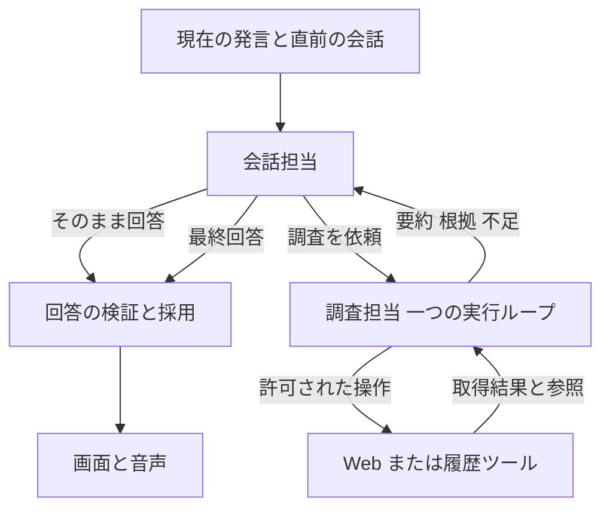

# Eumenes 会話と調査の構造整理計画

作成日: 2026-10-10 Asia/Tokyo  
状態: 承認済み。Web調査の汎用化とLuna接続を実装。汎用化時の変更した4領域に続き、Luna接続後のinference・agent-runtime・dialogueのverifyも通過。今回はverify:all・live・実機器検証を実行していない。liveと実機器を含むP5全体の受入は未完了。
参照基準: `de87ae8` とレビュー時の作業ツリー。実装開始時に差分を再確認する。

会話を理解する担当と、必要な調査を行う担当を一段の親子関係にする。会話担当は回答または調査依頼を一度に判断し、調査担当はツール操作と結果返却の一つのループで動く。権限・取消・予算・参照の検証は実行基盤に集約する。

今回の目的は、既存の分岐へ補正を追加することではなく、判断と状態の重複を取り除くことにある。Web取得、保存本文の読取り、会話履歴検索など、既にある機能とデータは再利用する。通常会話や音声の使い勝手を犠牲にして呼出し回数だけを減らした状態は完了としない。

本計画はユーザー承認後に実装した。[調査と履歴ツールの旧計画](research-and-history-tools-implementation-plan-2026-10-10.md)のエージェント制御部分を本計画で置き換え、保存・検索・権限・採用検証の要件は引き継ぐ。DeepSeekなど特定のharnessが設計の由来かどうかは、本計画の前提にしない。実装後の残存レビューは[再レビュー記録](verification/conversation-and-research-simplification/review.md)、今回のfixture・live・未受入項目は[検証記録](verification/conversation-and-research-simplification/verification.md)に記載する。

## 1 構造の到達点

| 担当 | 持つ責務 | 持たせない責務 |
| --- | --- | --- |
| 会話担当 | 会話の文脈の理解、回答、必要な調査の依頼、結果を利用者へ伝える | 能力検索と能力選択のための別々のモデル呼出し、調査途中の操作管理 |
| 調査担当 | 一つの依頼に対する情報取得、必要なら再検索、根拠付きの結果返却 | 再委任、独自の予算更新、権限判定、内部UUIDの転記 |
| 実行基盤 | 有効なツール、期限、回数、取消、参照、回答採用の管理 | 次にどの資料を読むべきかという意味上の判断をプロンプトの例で代行すること |

初版は一つの依頼につき調査担当を最大一つとする。Webと会話履歴は同じループの別ツールセットとして扱い、履歴担当へWeb送信権限を渡さない。Webと履歴の自動的な複合調査、並列調査、再帰的な委任は追加しない。既存のタイマー操作は会話担当から型付きの公開操作へ接続する。コーディング委任など別機能の内部構造は今回変更しない。

## 2 残すものと削るもの

| 現在の仕組み | 判断 | 整理後 |
| --- | --- | --- |
| ガード済みWeb取得、既存Providerとキャッシュ | 残す | 既存domainの公開操作を利用する |
| 本文の一時保存、`web.find`、`web.read_saved` | 残す | 調査担当のツールとして利用。取得と再提示を区別する |
| `history.search`、`history.read`、原文の版検証 | 残す | 会話原文を所有するdomainが継続して担当する |
| owner、cancelEpoch、版、期限、採用ticket | 残す | 実行基盤だけが管理。モデル入力へ管理情報を丸ごと出さない |
| 単一writer、transaction、queue、推論枠の解放 | 残す | 外部待機をtransaction外で行う既存原則を維持する |
| Memory・Worldと回答採用、音声の取消 | 残す | 既存の採用条件を変更せず、新しい会話経路にも接続する |
| capability registryと不変revision | 残す | 権限・設定・履歴の正本。モデルには小さな利用可能操作一覧を提示する |
| 会話前のCoordinatorによる`route → discover → select` | 削る | 会話担当の回答／調査依頼の一回の判断に統合する |
| 通常会話で`respond`だけ返し、別呼出しで文章を書く処理 | 削る | 最初の呼出しが回答本文まで返す |
| 通常経路と取得経路ごとのworker作成・期限計算 | 削る | worker開始関数と予算定義を一つにする |
| 必須`needs`、`requestQuote`の列挙、状態再送と補正 | 削る | 元依頼を常に保持し、不足は結果に記載。モデルに別の進捗台帳を作らせない |
| `nextInvocation`、参照番号の取り違え補正、候補URLの自動推奨 | 削る | ツール結果に必要な操作用参照だけを返し、次の行動は調査担当が選ぶ |
| stepごとの巨大な動的`OUTPUT_SCHEMA`生成 | 削る | 固定の操作契約と、stepに結び付いた許可スナップショットを使う |
| モデルへの`sourceId + viewId + excerptId`指定要求 | 削る | 一つの短い根拠参照で指定。内部では従来の版・範囲へ対応づける |
| 同じ資料という理由で古い範囲を捨てる処理 | 削る | 本文の表示量と、確認済み根拠の有効性を分離する |
| 誤出力の種類ごとに増えた専用の修復指示 | 削る | 構造違反の修復は固定契約に対して最大一回。終了時の指示を統一する |
| 天気・株価専用の取得先学習・本文抽出・固定回答 | 削る | 新規調査は共通WebツールとLLMの解釈を使う。保存済みデータの管理だけ残す |

追加のユーザー指示により、天気・株価専用の取得先学習は実行コードごと廃止する。既存データ・migration・閲覧と管理操作は残す。旧レポートのreaderは保持するが、旧実行ループを並走させない。

## 3 モデルが扱う契約

会話担当の判断は、回答、調査依頼、既存のタイマー操作に限定する。確認質問は回答の一種とする。調査依頼に必要なのは種別と解決すべき質問で、candidateRef、package revision、ownerなどは実行基盤が決める。

会話担当には、現在の入力と直前の採用済み会話を同じ文脈として渡す。「鎌倉の天気」の後の「では明日は？」を、会話担当が対象と日時を明確にした依頼へ変換する。元の発言と変換後の依頼は別項目として保持し、変換文そのものを新しい権限にはしない。URLの取得範囲は、現在の依頼と参照対象として認めた会話上の資料からホストが確定する。会話履歴全体をWeb担当へ転送しない。

調査担当の応答は、次の二つを基本契約とする。

| 応答 | モデルが返す内容 |
| --- | --- |
| 操作する | ツール名と引数 |
| 結果を返す | 結果種別、要約、根拠参照付きの主張、不足情報 |

結果種別は既存の`answered / partial / not_found / clarification_required / failed`を維持する。根拠のない回答を成功扱いしない。探索した範囲と取得失敗の一覧は、操作記録からホストが付ける。モデルに操作履歴を作文し直させる必須`exploration`は外す。

静的指示は「役割・未信頼資料の扱い・ツール選択・終了条件」にまとめる。ツール引数の説明は各ツール定義に一度だけ置く。現在の依頼、観測、残り予算、根拠一覧は実行時データとする。profile・SKILL・実行時の追加文へ同じ規則を重ねない。

会話の一回生成には、自然文とツール呼出しを同一応答で区別できる通信契約が必要になる。現在のLARM adapterはJSONオブジェクト出力を使っており、ネイティブのツール呼出し対応は未確認である。実装前段のP0で確認する。通常会話の逐次表示と内部制御の非公開を両立できる方式を採用し、単にJSON全体の完成まで待たせる変更は無条件に採用しない。対応がなければ、表示方式の変更と実測上の影響を別途提示して設計を確定する。別の分類モデルを追加して一回生成の問題を隠さない。

## 4 実行ループと予算を一つにする

実行上の状態は「モデルの応答待ち、ツールの結果待ち、終了」で表す。終了には成功、部分回答、失敗、取消を含む。検索、読取り、修復を独立したplannerの状態にせず、同じループに戻る操作として扱う。

1. ホストが現在の許可、予算、観測から次のモデル入力を作る。
2. モデルが操作または結果を返す。
3. ホストがそのstepに提示した契約、現在の権限・取消・ハード期限を検査する。
4. 操作なら結果を観測へ追加して1へ戻り、結果なら根拠を検査して会話担当へ返す。

step開始時の許可ツールと引数契約を、そのstepに結び付けて保持する。応答待ち中に終了予約時間の境界を越えても、提示済みのツール名を未知扱いしない。ただし、権限取消や実際の期限切れは引き続き拒否する。

終了時間の確保は次のstepを開始する前に判断する。モデル待ちと取得待ちを含めて次の一手を完了できない場合、終了専用のstepへ進める。新たな取得を開始できなくなった場合は予算上の終了として扱い、モデルの形式違反に数えない。終了専用stepでは別操作を促す例や指示を渡さない。

予算は一箇所で定義し、会話からの依頼、既定の取得経路、履歴、取得先切替が同じ定義を使う。初期の比較ではroot最大180秒、調査最大150秒、親回答用30秒、調査モデル1回最大45秒という既存の新revision向け上限を出発点にする。これらは待ち時間の目標値ではない。無駄な呼出しを取り除いた効果を測定してから調整する。

外部操作5回（検索2回・取得3回）、Webのローカル操作4回、履歴操作4回の上限は当初維持する。モデル呼出しはWeb最大12回、履歴最大7回の上限内で、終了一回と形式修復最大一回を予約する。失敗、経路変更、参照再発行で回数や期限をリセットしない。会話担当の形式修復も最大一回とし、正常な通常会話では発生させない。

取得失敗はツール結果として返す。正常な失敗結果を「JSON修復」に数えない。修復不能なら、ホストが検証可能な操作状況と不足を返す。意味を確認していない本文からホストが成功回答を組み立てることはしない。

## 5 根拠を保持する方法

モデル向け参照を二種類に絞る。資料操作には短い資料参照、報告には短い根拠参照を使う。例えば`d1`と`e1`であり、タスク内でホストが発行・解決する。不透明なcursorは資料参照に結び付けてツール結果から渡す。別のUUIDをコピーして直す補正はなくす。

根拠参照は一度提示した正確な抜粋に結び付け、同じ参照の内容を差し替えない。内部の対応表にはowner、資料版、提示view、範囲、digestを持つ。Web本文の正本は既存の一時保管、会話原文の正本はconversationのままとし、永続的な原文コピーを追加しない。

**旧計画の「最終stepに本文全体を再提示したviewだけ引用可能」という条件を変更する。** 同じタスクで一度提示し、現在も有効な根拠は、後のstepでも同じ根拠参照で引用できる。最終入力には参照一覧と短い原文の抜粋を残し、全文の再提示を必須にしない。未提示の範囲や別タスクの参照を引用することは引き続き拒否する。

この変更により、本文の表示枠から外れたことと、根拠が無効になったことを区別する。引用の確定はホストが元の提示記録から行う。履歴の訂正・撤回、owner、版、期限は報告受理時と最終回答採用時に再検証する。引用の存在を検査できても、主張の意味が正しいことまで機械的に保証したとは扱わない。

モデルに渡す観測は既存の20,000 byte上限を維持し、根拠一覧用の枠と最新結果用の枠に分ける。初期案は一覧8 KiB以下、全体20,000 byte以下、根拠参照64件以下とする。抜粋の短縮は参照が指す原文を変更しない。保管・提示の上限に達した場合は新規の根拠追加を止めて不足を通知し、古い根拠を黙って削除しない。

既に取得済みの同じ範囲の要求は、保存された結果の再提示として扱う。外部再取得を起こさず、成功済み操作の拒否から修復ループに入らない。モデル呼出し回数は通常どおり消費し、同一要求で進展がない場合は終了へ進む。取消・期限切れの結果を再提示することはない。

会話担当へ渡すのは要約、根拠に対応づけた主張、出典metadata、不足情報で、取得本文を丸ごと渡さない。タイムアウト時は、その時点で受理済みの結果と処理状況だけを利用する。最終報告前に保持した引用候補だけから、未検証の主張を作って採用しない。

## 6 domainとコードの変更範囲

| 場所 | 残す責務と変更内容 | 廃止対象 |
| --- | --- | --- |
| `dialogue` | 会話文脈、最初の判断と回答生成、最終採用、Memory・World・音声接続 | 通常会話を別の判断役へ先に送る経路 |
| `agent-runtime` | 調査workerの開始、一つのループ、一つの予算、結果検証、採用ticket | Coordinatorの`route/discover/select/refine`実行、別経路のworker起動、必須needs、専用補正群 |
| `tool-runtime` | stepに結び付いた許可、引数検査、参照の対応表、操作履歴、取消 | 内部IDをモデルに管理させる公開形式、再提示まで失敗扱いする重複判定 |
| `web-research`、`conversation` | 取得・保存・検索・範囲抽出・原文検証 | 基本機能の作り直しはしない |
| `capabilities` | 不変revision、利用可能ツール、権限と依存の確認 | モデルによる候補ID転記を必須にする実行経路 |
| `research-routes` とapplication adapter | 保存済みの取得先と手順の閲覧・停止・解除・削除 | 固定文法の分類、地域・銘柄辞書、専用抽出、固定回答、自動学習・再利用 |
| `inference`、`larm` | 同一生成での回答／操作の識別、既存の認証と取消 | 構造整理を理由にしたモデル・接続先・認証方式の変更 |

削除候補は`coordinator-schema.ts`、`request-quotes.ts`、`validate-needs.ts`、`read-next.ts`、動的schema用`read-schema.ts`、`route-step.ts`のagent起動部分。必要な純粋処理だけを新しい所有箇所へ移し、ファイル名を変えて旧分岐を温存しない。`context.ts`と`read-context.ts`の現行／旧版レンダラは、新規実行について一つの調査入力構築へ統合する。

domainをまとめて巨大なサービスを作る方針は採らない。SQLは所有domainに置き、下位domainからdialogueやagent-runtimeを参照しない。domain間の接続はapplicationのportで行う。

## 7 実装順序と移行

| 段階 | 作業 | 次へ進む条件 |
| --- | --- | --- |
| P0 契約確定 | 最初の会話生成の通信方式、既存stream・音声・態度収集との接続を確認。現行の呼出しを全段階で数える。対象コードと試験条件を固定 | 一回生成の実現方法と表示上の影響が説明できる。未解決なら製品実装へ進まず、その制約を提示 |
| P1 基盤統一 | 共通worker起動、予算、step許可、単一ループ、根拠参照を実装。時間境界と根拠脱落の最小再現を先に試験化 | 固定応答で新ループが通り、権限・取消・期限・原文版の検査を維持 |
| P2 調査接続 | Web／履歴ツール、学習済み取得経路を同じループへ接続。needsと次操作の自動推奨を外す | 一般調査と既定経路が同じ予算・結果契約で完了する |
| P3 会話統合 | 履歴を持つ会話担当から直接回答または調査依頼。タイマーなど既存操作を公開port経由で接続 | 通常会話一回、文脈を伴う続きの依頼、調査後の回答、音声取消のfixtureが通る |
| P4 切替と削除 | 新しいrunを新経路へ固定。旧実行を終了させて旧planner・補正・入口を削除。古い結果のreaderを残す | 二つの通常実行経路が残っていない。既存の保存結果・設定を引き続き読める |
| P5 受入 | 対象domain、全体検証、固定条件のlive、音声の実機器受入 | 下記の機能・性能・安全性の条件を満たし、未確認事項を分けて記録 |

新経路は小さな縦断実装として作る。移行中に同じ利用者入力を旧・新両方で実行して外部操作を二重に起こさない。runの途中で実行方式を切り替えず、旧runは終了または明示的な中断後に新規runで再開する。失敗時に自動で旧方式へ戻る経路は作らない。

DB migrationとcapability revisionの既存内容は変更しない。必要な追加だけを新しい版で行う。製品DB、会話、設定、取得先学習の保存情報を削除しない。移行期間の切替設定は一つに限定し、切替完了時に旧実行の分岐ごと除去する。無関係な開発変更は巻き戻さない。

## 8 完了条件と検証方法

| 対象 | 観測する合格条件 |
| --- | --- |
| 通常会話 | 回答までモデル一回。先行する分類・能力選択の呼出しがない |
| 続きの会話 | 「鎌倉の今日の天気」→「では明日は？」で対象を引き継ぐ。履歴のない推測で対象を作らない |
| 長文資料 | 離れた三箇所の条件を確認し、後の読取りで前の根拠が引用不能にならない |
| 再検索・別資料 | 必要な場合だけ検索語や資料を変更して答える。最初に十分な根拠が得られたケースへ余計な操作を要求しない |
| 時間境界 | 提示時70秒・応答時45秒のケースを誤ったツール名として拒否しない。次stepは終了方針へ進む |
| 経路の一致 | 通常依頼と既定取得経路で、同じ調査方式に同じ期限・予算が適用される |
| 長い依頼 | 七つ目の文、中間の重要条件が引用候補の切捨てで表現不能にならない |
| 履歴 | Memory OFFでも原文を参照できる。訂正・撤回・別owner・期限切れ・未発見の範囲を正しく扱う |
| 障害と形式違反 | 取得失敗と構造違反を区別。構造修復は最大一回、上限後は有限に終了し、未取得の内容を補わない |
| 取消と音声 | 取消後の結果を採用・発声しない。内部制御JSONを表示・読み上げ・態度収集へ渡さない |

まず固定応答で、取得順序、予算、根拠保持、終了、取消を確認する。モデルの形式と実装の都合をなぞる試験より、利用者が期待する結果と再現した境界を検査する。単体試験は各所有domain、横断試験はapplicationに置く。

liveではSQLiteに保存された接続先とモデルprofileを読み取り確認し、実際に選ばれたモデルの識別情報を含めて試験条件を固定する。既存のbackend認証経路を使い、製品DBや設定全体をコピーせず隔離環境で実施する。質問、取得資料、実装revision、予算を同じ比較単位内で変更しない。

計測は最初の会話判断、調査中、最終回答のすべての推論を含める。既存の`totalModelCalls`のように、agent側の回数だけで最終回答の推論を落とさない。記録するのは各段階の回数・所要時間、画面の表示開始、回答完了、音声開始、成功／部分回答／失敗の内訳と安全なエラー分類とする。本文・生応答・秘密を運用ログへ追加しない。

通常会話の一回生成と重複制御の撤去は構造上の必須条件とする。調査では回数が減っても回答品質が落ちれば不合格。表示開始や音声開始が遅くなる場合も、完了時刻だけを示して改善としない。少数の試行から一般的な成功率や最適性を断定しない。

liveは代表ケースを固定し、各ケースの連続二回の成功を最低限の受入材料とする。同じ失敗が二回続いたら一括再試験を止め、外部通信・モデル応答・ホスト判定のどこで失敗したかを最小ケースで確認して報告する。修正対象と仮説を決めずにプロンプトを追加して再実行しない。取得側のbot challengeやtimeoutは回答能力の失敗と分けて記録し、guardを迂回しない。

日常の検証は`bun run verify -- --domain <name>`、横断変更では利用側domainと`bun run verify:all`を実行する。fixture、live、実機器の結果を別々に残す。音声経路に触れるため、実機器の三往復と割込み受入まで音声MVPの完成を宣言しない。

## 9 今回の計画で変えない範囲

下記で追加承認されたWeb調査のLuna委任方針を除き、新しいモデルの導入、Providerの交換、RAGやベクトル検索、会話圧縮、履歴画面の刷新、任意コード実行、新しいエージェント基盤、コーディング担当の再設計は含めない。モデル変更や期限延長によって制御上の問題を見えなくすることは、構造整理の完了条件にしない。

実装前に確認してもらう主な判断は、会話判断の統合、必須needsと専用補正の撤去、一度提示した有効な根拠を後続stepでも引用可能にする変更、取得先学習を独立したagent起動から外す変更の四点である。これらを承認後に実装へ進み、通常会話の通信方式に制約が判明した場合はP0で具体的な影響を提示する。

## 10 Web調査の汎用化とCodex Lunaの利用方針

2026-10-10の追加指示。意味理解・意図・分類・計画・資料選択・本文の解釈はLLMが担当する。コードは入出力、外部連携、実行、状態管理、契約・根拠参照・権限・取消・予算を検査する。語句や個別シナリオに合わせた正規表現、辞書、固定回答で判断を置き換えない。

既存の調査LLM、固定invoke/finish契約、Web検索・読取り・保存本文ツールを再利用する。新しい汎用フレームワークは追加しない。新規実行は `package:web.research@8` と汎用SKILL revision 7を使い、lookup/read/find/read_savedを提供する。公表済みの古いrevisionは内容とhashを維持するが、新しい実行では専用forecast/quoteを公開しない。

専用URL生成、地点・銘柄辞書、天気・株価の本文変換、固定文法の発話分類、ホストの意味抽出・回答生成、取得先学習の実行コードを削除する。取得JSONは全項目を未信頼データとしてガードへ渡し、解釈はLLMが行う。旧DB、migration、capability revision、保存済みレポートと手順の閲覧・停止・解除・削除は維持する。廃止した機能の試験は退役させ、汎用取得と既存データの管理の回帰ケースへ置き換える。

Codex Lunaの対象はWebを使う調べ物で、コードベース調査・実装・コードレビュー・会話履歴調査は含めない。簡単な調査は現在の調査担当を使う。詳細説明、長文や複数資料の整理、比較、多数のニュースを扱う調査はLunaへ委任してよい。リアルタイム性だけでLunaを除外しない。

| 依頼の例 | 利用方針 |
| --- | --- |
| 「WBSってなんだっけ？」 | 現在の調査担当による語句確認 |
| 簡単な最新情報・現在の状況の確認 | 現在の調査担当 |
| 「DeepSeek harnessってなに？詳細教えて」 | Lunaを利用してよい |
| 長文・複数資料の詳しい説明や比較 | Lunaを利用してよい |
| 多数のニュースを集めて整理する | Lunaを利用してよい |

委任の選択は依頼と文脈を持つLLMが行う。語句辞書、文字数、URL数、ニュース語句などによる事前分類は追加しない。同一依頼の重複取得や無制限の再委任を起こさず、既存のroot・取消・期限・回数・根拠検証の管理下で実行する。

会話LLMが `research` と `research_web_luna` を選択する。Lunaの選択を子入力と推論requestへ保存し、既存の調査loopから `gpt-6-luna` のCodex CLIを呼ぶ。Lunaも同じ検索・本文取得・資料guard・根拠参照・invoke/finish契約・期限・取消・receipt採用検査を使う。履歴へのLuna委任と、利用できないLunaの実行は契約検査で拒否する。既存coding-runnerは変更せず、Webの判断だけを行う最小CLI接続をinferenceのadapterに置く。CLIの外部仕様に必要な引数、固定モデル、環境変数の許可リスト、出力量制限、process group停止は意味判断を行わない。接続・認証エラーで別モデルへ自動変更しない。

### 10.3 現在の調査担当を簡単な検索に限定

追加指示により、現在の調査担当は `package:web.quick@1` に限定する。提供ツールはlookup/readのみ、検索1回・ページ取得1回、モデル呼出しは報告候補の意味検証と修正分を含め最大5回。保存本文の探索や複数資料向けの従来経路は現在の担当から外す。Codex Lunaは `package:web.research@9` を使い、長文・複数資料用の共通処理を引き続き利用する。担当の選択はLLMが行い、語句・文字数・対象別の製品分岐は追加しない。Lunaを利用できない場合は制約を伝え、現在の担当へ重い調査を戻さない。
