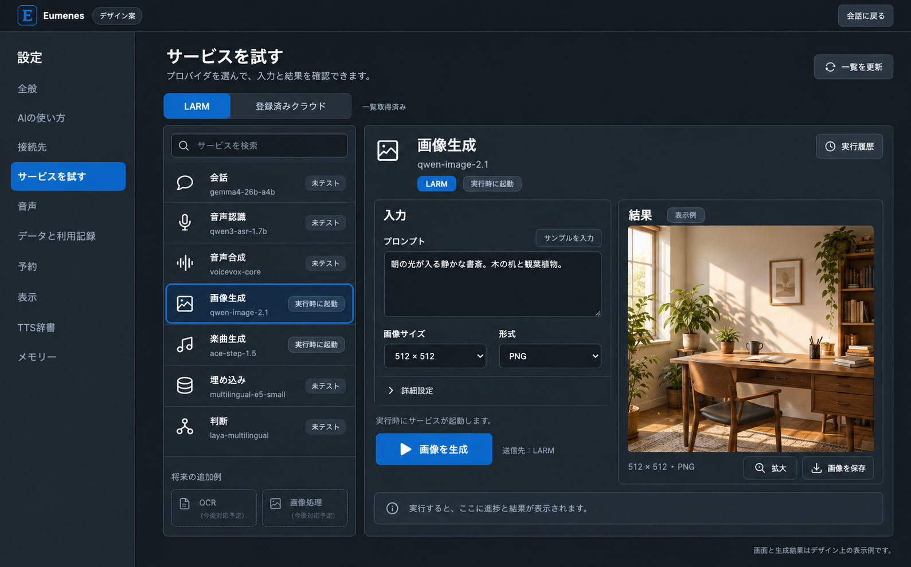

# 設定画面のサービス試用機能

作成日: 2026-10-09 Asia/Tokyo  
状態: 設計案。LARM の公開カタログと OpenAPI は GET で確認済み。試用機能の実装、LARM の生成 POST、成果物取得の実検証は今回の対象外。

設定メニューに「サービスを試す」を追加する。会話・音声・画像・楽曲と、将来の OCR や画像処理を同じ一覧から選び、入力、実行、結果確認まで行えるようにする。画面の名称は「単体テスト」より操作内容が伝わる「サービスを試す」とし、自動試験とは別に、選択したプロバイダだけを呼ぶ動作確認を提供する。

## 現状と確認できた契約

- 現在の設定 UI は `web/src/domains/settings/index.tsx`。接続先の疎通確認とクラウド resource の少量テストがある。
- `api/domains/inference/service/index.ts` の `startProbe` は LARM 全体の確認、または登録したクラウド resource の固定入力テスト。任意入力、画像プレビュー、楽曲再生には対応していない。
- `api/domains/larm/contracts/index.ts` の公開 Capability は llm / asr / tts。内部の System One 呼び出しはあるが、一覧全体を UI に渡す契約ではない。
- LARM の秘密、claim、lease は backend に留める。ブラウザと CLI は Eumenes API を利用する。

2026-10-09 に、環境で指定された LARM 接続先（未指定時はプロジェクト既定）へ以下の GET を実行し、いずれも 200 を確認した。保存済み Eumenes 設定の DB は開いていないため、画面で接続先が変更されている場合はその接続先の検証ではない。

| 読み取った API | 確認結果 |
| --- | --- |
| `/openapi.json` | 画像生成の正式な入出力 schema が存在。楽曲の job、進捗、取消、成果物も定義されている |
| `/v3/agent-profiles` | 全 Profile 一覧を取得可能。ただし、この応答の services は全件空だった |
| `/v3/agent-profiles?profile=SAAA-gemma4-26b` | 会話 gemma4-26b-a4b、音声認識 qwen3-asr-1.7b、音声合成 voicevox-core、embedding multilingual-e5-small、System One laya-multilingual |
| `/v3/agent-profiles?profile=SAAA-w-Image` | `media.image.generate` / `larm.image-generation.v1` / qwen-image-2.1 を services に広告 |
| `/v3/agent-profiles?profile=SAAA-w-music` | `media.music.generate` / `larm.music-generation.v1` / ace-step-1.5 を services に広告 |

上記応答の catalogRevision は `1411986f3a921403a3a2ef724fb30e1e0390aed2471a58a7d3976dd346bdcb37`。取得時点の証拠であり、以後の固定値にはしない。OpenAPI の selector enum には SAAA-gemma4-26b が載っていないが、実際の問い合わせは成功した。enum だけで現在設定されている selector を拒否しない。

画像・楽曲は `minWarmInstances: 0`、`idleTtlSeconds: 0`。公開契約では生成要求に応じて起動し、成果物を保存して worker を停止する。「静的に登録されている」と「常時起動している」は別属性として扱う。`/v1/services` は現状 ASR 用の ServiceHarness schema であり、汎用サービス一覧の代わりにはならない。

参照: [既存設定計画](settings-screen-implementation-plan.md)、[SAAA の参照用契約](/Users/y.noguchi/Code/SAAA/docs/larm-agent-connection-provide.md)。SAAA 文書にある 10 月 1 日の画像 API 未定義・404 は過去の検証結果であり、現在の契約に転記しない。今回の GET 成功も、生成成功の証拠にはしない。

## 画面と操作

「接続先」の次に「サービスを試す」を配置する。既存カテゴリは順序依存の数値を使っているため、追加時には安定した文字列 ID に変更し、音声・予約・TTS 辞書・メモリーへの遷移を回帰確認する。

デスクトップは既存の設定サイドバー、サービス一覧、試用領域の三列。試用領域内を入力と結果の二列にするのは十分な幅がある場合だけとする。狭い画面では一覧から詳細へ遷移し、「一覧へ戻る」を提供する。

1. 上部に「LARM / 登録済みクラウド」、用途検索、一覧を更新、最終取得時刻を置く。初期表示は「このアプリで使うサービス」。詳細フィルターで LARM の全 Profile を表示できる。
2. 行には用途、プロバイダまたはモデル、接続経路、起動方式、直近の試用結果を表示する。停止中の要求時起動サービスは「実行時に起動」と表示する。
3. 行を選ぶと対象を固定した入力フォームを開く。「サンプルを入力」、入力項目、実行ボタン、進捗、結果を同じ領域に置く。
4. 「公開確認済み / 実行未確認」「成功」「失敗」「確認不能」「設定変更後は未確認」を区別する。HTTP 到達、生成完了、成果物取得、ユーザーの品質評価を一つの緑色バッジにまとめない。
5. 下部の履歴に対象、日時、所要時間、状態を表示する。入力や成果物は初期状態では履歴へ永続保存せず、必要なら結果の保存操作を使う。

試用は保存済み接続設定を使う。接続・送信許可の編集中は「変更を適用すると試せます」と案内し、未適用の接続と保存済み credential の混在を防ぐ。試用フォームの入力は設定変更として扱わない。試用結果を通常会話やメモリーに自動追加しない。

### 用途別の入力と結果

| 用途 | 入力 | 結果 |
| --- | --- | --- |
| 会話、分類 | 短い文章。必要なら分類の選択肢 | 返答、実際のモデル、所要時間。分類は専用サンプルと一致判定 |
| 音声認識 | 音声ファイル、明示操作による短い録音 | 試聴、文字起こし、所要時間 |
| 音声合成 | 文章、声、対応する調整項目 | 音声プレイヤー、音声保存。自動再生しない |
| 画像生成 | プロンプト、幅・高さ、対応する seed 等 | 画像、サイズ、形式、所要時間、保存 |
| 楽曲生成 | 曲の説明、長さ、歌声の有無、対応する歌詞等 | 起動・生成・エンコードの進捗、プレイヤー、保存 |
| 埋め込み | 比較する短文と query / passage 指定 | 次元数、類似度、所要時間。モデルの品質保証とは分ける |
| System One | サンプル状態、選択肢と判断基準 | 選択結果、妥当な応答形式かの判定 |
| OCR（将来） | 画像、対応言語 | 抽出テキスト、座標がある場合の枠表示 |
| 画像処理（将来） | 画像、処理の種類とパラメータ | 処理前後、検出枠、構造化データ |

OpenCV は実装ライブラリ名として詳細に表示し、一覧の用途は「画像処理」とする。未提供の OCR・画像処理を稼働中のカードとして出さない。説明用モックで示す場合は「将来の追加例」と明記する。

## 一覧取得と拡張契約

一覧取得と実行を分ける。画面を開いたり一覧を更新しただけでは Connection 作成、claim、生成、Cold サービスの起動確認を行わない。

初版の backend は次の情報を統合する。

1. 全 Profile の `/v3/agent-profiles` から `providers` と `services` を取得する。
2. 保存済みの会話 selector と、対応サービス selector（現在は SAAA-w-Image / SAAA-w-music）を個別に解決し、追加の services を取得する。これは現在の LARM に必要な互換処理。将来のサービスごとに恒久的な selector 固定値を増やし続けない。
3. settings に登録されたクラウド resource を、source が異なる候補として統合する。

同一サービスが複数 Profile に出る場合は、接続先 ID、種別、provider/service 名、protocol、model、endpoint と必要な接続条件で識別し、同じ実行先だけをまとめる。選択可能な Profile/selector の由来を保持し、単に model 名が同じという理由では統合しない。具体 Profile ID と Connection 作成に使う公開 selector は区別する。起動経路が解決できない全一覧の項目は表示できるが「接続方法が未対応」とする。

各取得の revision と設定 fingerprint を保持する。異なる revision の応答を無条件で混ぜない。取得中の改訂は読み取りだけを限定再試行し、なお不整合なら「一覧の更新が必要」とする。一部取得が失敗しても他の一覧は表示し、欠けた範囲を明記する。前回データは取得日時と「古い情報」を付けて表示し、古い endpoint のまま実行しない。

### Eumenes 内部の ServiceDescriptor 案

| 項目 | 用途 |
| --- | --- |
| id、source、connectionId、origins | 安定した候補識別子、LARM / cloud、取得した selector と Profile |
| capability、supportedCapabilities、protocol、model | 用途選択と対応 adapter の解決 |
| accessMode | `claimed-provider` または `direct-service`。認証と実行経路を分ける |
| startupPolicy | 常時準備、要求時起動、不明。未取得を停止や障害に変換しない |
| catalogRevision、fingerprint、discoveredAt | 実行前の改訂確認、古い結果の識別 |
| availability、testability、reason | LARM の公開情報と Eumenes の対応状況を分離 |
| inputSchema、outputKinds、limits、cancelMode | 信頼された adapter が公開する入力・結果・制限 |

endpoint と認証情報は backend で保持し、実行要求は descriptor ID を指定する。クライアントから任意 URL や認証 header を受け取らない。

将来 LARM に汎用カタログを追加するなら、selector に依存しない安定した service ID、capability、protocolVersion、inputSchema、outputKinds、startupPolicy、limits、取消・進捗の対応、catalogRevision を広告する契約を共同で定める。これは提案であり、現在ある API として扱わない。現行の services protocol enum は画像・楽曲に限定されているので、OCR / 画像処理には LARM 側の契約拡張も必要になる。

既知の protocol は Eumenes の adapter registry で入力を再検証して実行する。安全な JSON Schema の一部（文字列、数値、選択、ファイル参照）から基本フォームを生成し、画像・音声・OCR の結果 renderer を追加する。未知の protocol は一覧表示のみとし、任意 HTTP 実行や外部スクリプトを許す仕組みにはしない。新サービス追加時は capability と対応 adapter を登録すれば既存の一覧・実行台帳・履歴を再利用できる構成にする。

## 実行と状態管理

試用では選択対象に固定し、通常会話の自動フォールバックを適用しない。成功したときには「実際にどのモデルが処理したか」を表示する。

- claimed-provider: LARM が正式に受け付ける provider 選択を確認して、対象だけを呼ぶ。現行 Eumenes の LLM 単独 / 音声 Profile 全体の制約を、そのまま任意 provider 対応とみなさない。Profile 全体の確保が必要な場合は、その範囲を表示する。会話中の lease を解放・切替しないための利用カウントと排他を維持する。
- direct-service: catalog で広告された endpoint に一度だけ POST する。画像・楽曲では Warm Connection や claim を要求しない。起動・GPU の競合は LARM の判断に従い、409 等は「ほかの処理が使用中」として手動再試行を提供する。
- クラウド: 現在の送信許可、接続有効状態、credential を検査する。入力がどの接続先へ送られるかを実行ボタンの近くに表示する。

backend の試用台帳を正本とする。`accepted → preparing → running → fetching-result → succeeded` を基本に、failed / cancelled / interrupted / unknown を持つ。画像の同期 API では起動と生成の内訳を取得できないので「起動・生成を待っています」と表示し、架空の進捗率を出さない。楽曲は LARM の queued / loading / generating / encoding を対応付ける。

生成が完了して成果物 GET だけ失敗した場合は「生成済み・結果取得に失敗」。生成を再送せず、成果物 GET だけ再試行する。同期 POST の通信切断は結果不明であり「生成失敗」と断定しない。

### 現在の画像と楽曲の初期設定案

- 画像: 512 × 512、PNG、1 枚の小さい試用から開始。幅と高さは現行 schema の 512 / 768 / 1024。steps は 1〜50、seed は対応する詳細項目へ。推奨品質を実測していないため「最高品質」のような表示はしない。正式応答の `artifact`（または同じ内容の `artifacts[0]`）を取得・検証する。
- 楽曲: まず 10 秒、歌声なし。API の durationSeconds は 1〜600 だが、provider ごとの capability 制限があれば共通部分に絞る。歌声・歌詞などは対応確認後に有効化する。202 の jobId を保存し、既存 job を追跡する。
- 期限案: 生成受付の待機は最大 15 分、楽曲の job 追跡は受付後最大 30 分、成果物 GET は 120 秒。実測前の上限案であり、所要時間予測として表示しない。

「中止」は試用の世代を無効化して遅着結果を採用しない。楽曲は遠隔 DELETE の確認前に「停止済み」と表示しない。画像は現在の同期契約に取消 API がないため「待機を終了」を用い、生成自体は継続する可能性を示す。POST 中に jobId が遅れて返る場合も記録し、取消可能なら追って停止要求を行う。

Eumenes の受付には requestKey を使い、二重クリックで job を二つ作らない。ただし Eumenes のキーだけで LARM の生成が exactly-once になるとは主張しない。送信済みか不明な POST は自動再送しない。

初版はアプリ全体の試用を 1 件ずつに制限し、会話との GPU 競合も表示する。画面離脱後も backend の実行を維持し、戻ったら同じ台帳を読む。再起動後、jobId がある楽曲は再照会できる。同期画像は確認できる artifact ID がなければ interrupted / unknown とし、新規生成しない。

UI は既存の認証付き SSE で変更通知を受け、API を再取得する。LARM の job に SSE が使える場合は backend で接続し、使えなければ実行中の job だけを期限付きで照会する。待機中のサービスに定期 health check を行わない。

## 所有境界と API 案

| 所有者 | 責務 |
| --- | --- |
| larm | catalog 正規化、Profile/selector、claim/lease、公開サービスの transport と credential、LARM 固有の応答検証 |
| settings | 接続設定と送信許可。画像・OCR を会話用 routes の三用途へ無理に追加しない |
| inference | 既存の会話・ASR・TTS・クラウド adapter。試用向けには対象固定の公開操作を提供 |
| service-tests（新設） | 試用入力の検査、adapter 登録、実行台帳、取消世代、成果物参照と短期保持。依存は settings / larm / inference |
| application | 公開サービスの組立て、設定メニューへの試用 UI の配置 |

新しい domain から dialogue や voice-dialogue の内部を操作しない。下位 domain から service-tests を参照しない。試用の SQL と試験は service-tests に置き、他 domain のテーブルへ直接書かない。複数 domain の保存が必要なら単一 writer の transaction と各 domain の公開操作を使う。ネットワーク待機を transaction に含めない。

以下は新規 Eumenes API の候補名であり、実装済みではない。

| API | 意味 |
| --- | --- |
| `GET /api/service-tests/catalog` | 秘密を除いた一覧と取得状態 |
| `POST /api/service-tests/catalog/refresh` | 読み取りだけの再発見 |
| `POST /api/service-tests/uploads` | サイズ・形式を検証した短期の入力参照を作る |
| `POST /api/service-tests/runs` | descriptor ID、fingerprint、入力、requestKey で受付。202 と run ID |
| `GET /api/service-tests/runs` | 試用履歴の概要 |
| `GET /api/service-tests/runs/:id` | 現在状態、実際の対象、結果参照 |
| `POST /api/service-tests/runs/:id/cancel` | 待機終了または遠隔取消。受付と停止確認を区別 |
| `GET /api/service-tests/runs/:id/artifacts/:artifactId` | run 所有を確認した成果物取得・再取得 |

永続台帳には対象、revision、時刻、状態、jobId、opaque な成果物参照、構造化したエラー分類を保存する。会話本文・音声・入力画像・credential・Provider の生応答をログに出さない。診断は runId / jobId / X-Request-Id で追えるようにする。

入力とプレビュー内容は短期保持とし、初版の案は未使用 30 分、試用履歴は直近 50 件、プレビュー参照は直近 16 件。実行中の参照は削除しない。実装時に容量制限と削除処理を一緒に導入する。LARM 上の共有 artifact は Eumenes の履歴削除で勝手に消さない。

画像と楽曲の成果物は backend から LARM の公開 origin に取得し、リダイレクトや別 origin への credential 転送を拒否する。claim された provider 接続は既存の別契約に従い、成果物 proxy の公開 origin 制約と混同しない。Content-Type、サイズ、artifact ID と run の対応を検査し、ブラウザには Eumenes の参照だけを返す。

## 実装順と受入

1. カタログと UI 一覧を作る。全一覧と selector 解決、改訂、部分失敗、重複排除、未知 protocol の表示を fixture で固定する。
2. 既存の会話・ASR・TTS を対象固定で試せるようにし、埋め込み・System One・分類の専用サンプルを追加する。通常会話の経路と設定を変えないことを確認する。
3. 画像の生成から preview 取得までを一通り実装する。画像 POST 成功と artifact GET 成功を分けて検証する。
4. 楽曲の job、取消、試聴、再起動後の追跡を追加する。
5. LARM の OCR / 画像処理の契約が定まったら adapter と renderer を追加する。モデル不要の処理も model 任意の descriptor として扱えるよう、将来の汎用契約を調整する。

fixture の必須ケースは、一覧取得で起動しないこと、全一覧だけでは漏れる services の補完、Cold を利用不能としないこと、対象固定でフォールバックしないこと、生成 POST 非再送、二重受付防止、成果物のみの取得失敗、取消後の遅着、接続・許可改訂、未知 protocol、別 origin、容量超過、画面復帰と backend 再起動である。

実装後は `bun run verify -- --domain larm`、`--domain inference`、`--domain settings`、登録した `--domain service-tests` と利用側 domain を実行し、横断変更として `bun run verify:all` を通す。live は別記録にし、画像・楽曲とも実要求から成果物を表示・再生・保存するところまで確認する。ASR / TTS の個別成功を、音声 MVP の実機器 3 往復受入の代わりにはしない。

## デザイン画像

既存の暗い背景、青い選択色、細い境界線を使う。一覧では画像生成を選択し、入力と画像プレビューが一画面に収まる案を示す。画面内の結果と計測値は表示例で、LARM の実生成結果ではない。OCR と画像処理は「将来の追加例」として分ける。

画像生成には Codex 内蔵の imagegen を使用した。実行したプロンプトは [生成プロンプト](provider-playground-image-prompt-2026-10-09.txt) に保存した。

