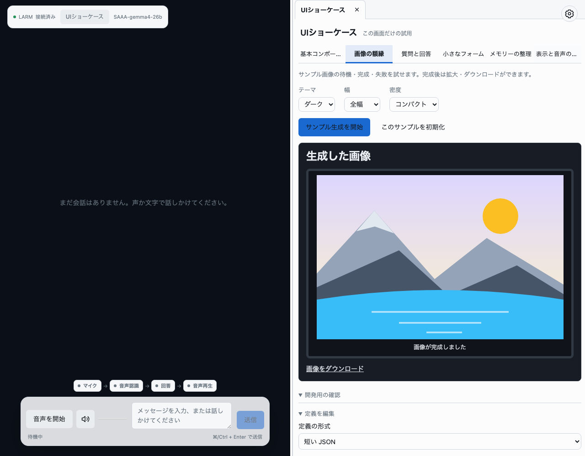
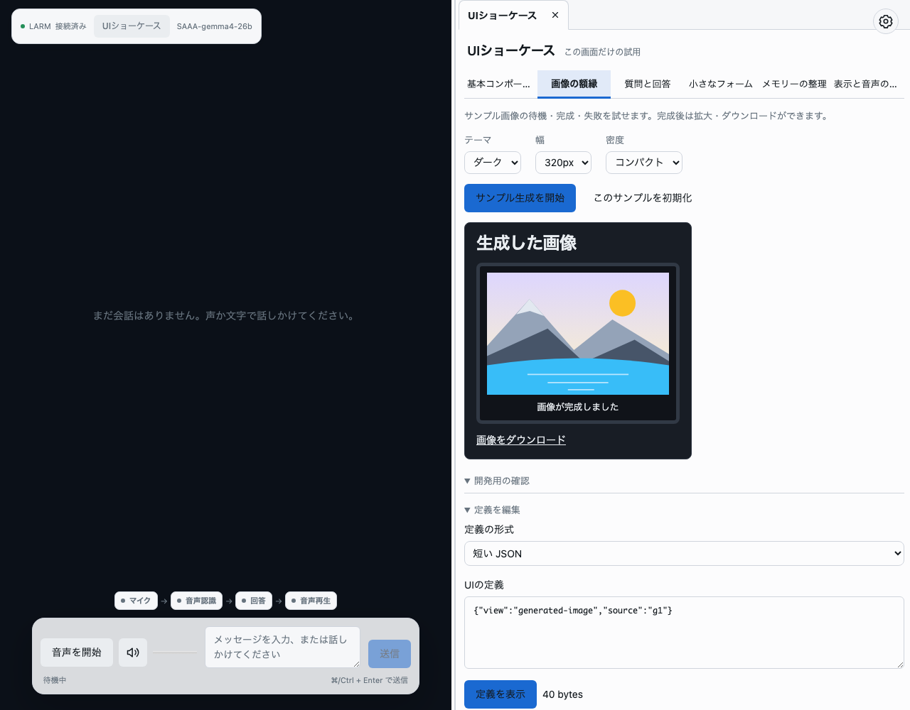
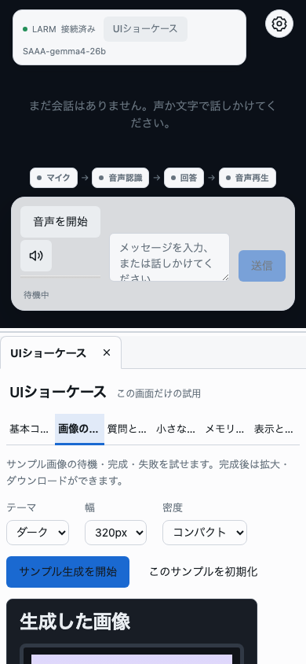

# OpenUI Artifact P0/P1 検証記録

## 2026-10-10 質問と回答の RadioButtonGroup

標準 input を並べる表示から、共通 `RadioButtonGroup` に変更。行全体を選択でき、選択状態を丸印・青い枠・背景で区別する。長文は省略せず折り返し、矢印キーとフォーカス表示を維持する。選択だけでは送信しない。回答済みの表示は runtime の回答を正本にし、サンプル切替から戻っても選択と変更禁止を保つ。

すべて fixture / ローカルでの検証。

- DesignSystem 単体試験：58ファイル・1,084件 pass（新規ラジオ部品2件を含む）。
- Showcase Chromium：11 / 11 pass。行の右端での選択、矢印キー、ホバー時の選択色保持、回答後の変更禁止、再表示、リセット、長文・320pxでの横はみ出しを確認。
- Webビルド・最終DesignSystemビルド・全体TypeScript・対象lint・新規部品Biome：pass。
- artifact domain：整形 / lint / 型 / 34件の試験は通過したが、複数回とも並行更新を検出して最後の source 固定確認で停止。domain gate 完了とは扱わない。
- verify:all：初回はブラウザ試験ファイルの整形で停止。整形後の再実行は別の検証が実行中のため開始できず、全体 gate は未完了。
- context_compile / compile_eval：今回各1回。

実画面を目視確認：[ダーク](question-radio-dark.png) / [ライト](question-radio-light.png) / [320px](question-radio-narrow.png)。

## 2026-10-10 会話とアーティファクト境界のリサイズ

`ResizableWorkspace` を追加し、左右の幅と狭い画面での上下の高さをドラッグ・矢印キーで調整できるようにした。タッチ操作も使用可能。比率は25〜75%に制限し、ダブルクリック / Enter で半分へ戻す。比率の変更・タブの開閉・画面幅の切替で下書きを保持し、最後のタブを閉じると会話を全幅へ戻す。

すべて fixture とローカルビルドでの検証。ライブ Provider・実機器の受入は含まない。

| 検証 | 結果 |
| --- | --- |
| domain verify: artifact / conversation / timers | 各 pass。artifact 34件、conversation は backend 12件 + Web 21件、timers は backend 10件 + Web 13件 |
| Web 単体試験 / 型検査 / ビルド | 38ファイル・159件 pass。全体 TypeScript と Web ビルドも pass |
| Artifact + timers Chromium、worker 1 | 14 / 15 pass。左右・上下の実寸変化、下書き保持、キー操作、比率の制限と初期化、再表示、通知による分割崩れの防止を確認。タイマー取消後の表示待ちが1件失敗し、同じ試験の単独再実行は1 / 1 pass。連続実行での失敗原因は未確定 |
| タッチ Chromium 追加試験 | 1 / 1 pass。指の移動量に沿った高さ変更、終了・取消時のドラッグ解除、取消後のフォーム操作を確認。実機器試験ではない |
| `bun run verify:all` | 未通過。今回の範囲外の `api/application/world-scheduling.test.ts`、`api/domains/world/service/extraction-handler.ts`、`api/domains/world/test/scheduling.test.ts`、`scripts/toolchain-live.ts` の書式で停止 |

幅1280pxと390pxの画面を確認：[左右の調整](resizable-workspace-desktop.png) / [上下の調整](resizable-workspace-mobile.png)。全体検証とタイマー連続試験の全通過とは扱わない。

2026-10-09 JST。すべて fixture での検証。ライブの LARM / 画像生成 Provider / 実機器の受入は含めない。

## 実装・検証済み

- 6種類の view を、本物の OpenUI SDK parser / Renderer と既存 Tailwind v4 DesignSystem で描画。
- 40 bytes の画像定義を固定したまま非同期状態を更新。placeholder、成功、失敗、取消、読込失敗を表示。
- 全画面表示、幅90%超の確認、フォーカス、Escape、画像ダウンロードの成功を Chromium で確認。
- 選択 / 自由回答、回答後の操作停止、期限切れ、インライン質問。
- フォームの必須入力、送信失敗と再試行、二重クリック拒否、リセット、source 更新時の入力保持。
- メモリー訂正と選択、設定の保存を fixture の receipt と更新データで確認。
- 未知の view / source / 余分な項目 / 巨大な定義 / 不正な Lang を拒否。文字列内のプログラムは実行されない。
- 取消後の古い画像完了、初期化前の送信、同じ操作 ID、古い revision を単体試験で確認。
- Markdown タブへの切替時も Showcase の下書きを保持。閉じると破棄。
- ダークテーマ、320px のプレビュー、390px のスマートフォン表示をキャプチャで目視確認。横方向のはみ出しを E2E でも検査。

## 試験結果

| コマンド | 結果 |
| --- | --- |
| `bun run verify -- --domain artifact` | pass。整形 / lint / 境界 / 型 / 32件の単体試験。保存した [report](verify-artifact.json) を参照 |
| `bun x playwright test tests/browser/artifact-showcase.spec.ts` | 4 / 4 pass。ブラウザから Artifact を開いて操作 |
| `bun x vitest run web/src/domains/artifact web/src/components/domains/conversation web/src/domains/settings` | 63 / 63 pass |
| `bun test api/domains/agent-runtime/test` | 28 / 28 pass。ブラウザの起動障害を修正した contracts 参照の回帰検査 |
| `bun run build:web` | pass。DesignSystem のビルドも実行。Showcase は独立した約97KB（gzip 約32KB）の JS chunk |
| `bun run verify:all` | 未通過。並行作業中の coding / timers など、今回の範囲外のファイルの整形で停止 |

全体検証を通過したとは扱わない。検証中に他の作業で source が変わった実行もあり、それらを pass に数えていない。対象 domain の最終 gate は source 固定チェックを含めて通過した。

ブラウザの起動時に、agent-runtime の契約定義が capabilities の実装エントリを参照し、`node:fs` を Web に持ち込む経路を確認した。参照を公開 contracts エントリへ変更し、ビルドから browser externalization 警告が消えたことと、実ブラウザの起動を確認した。

## 画面

デスクトップでは会話の横、スマートフォンでは会話に続く Artifact として表示する。SDK の開発用 Inspect が写るのは開発モードでの E2E のため。

## 2026-10-10 デザインシステム調整

画像案をもとに、DesignSystem の Tabs に下線型（既定の `line`）と内容欄につながる `workspace` を実装した。Artifact の上部・サンプル切替ともにこの共通部品を使い、選択・矢印キー・パネルの関連付けを Radix に統一した。閉じるボタンはタブ選択ボタンの隣に独立させ、最後のタブを閉じると表示欄も消える。

ライト・ダークの配色を共通テーマで調整し、プレビューの重複した色・密度定義を除去した。ボタンとカードの影、プレビューの二重枠、大きな表示設定を整理した。タブ周囲の余白は0、内容欄のみ全周 Tailwind `p-2`。定義編集と試用操作は折りたたみ、スマートフォンでは会話ステータスがタブを覆わないようにした。

今回もすべて fixture での検証。

| 検証 | 結果 |
| --- | --- |
| DesignSystem `bun run test` | 57ファイル / 1,082件 pass。タブの矢印キー・無効項目・全ラベル・独立した閉じる操作も確認 |
| `bun x vitest run web` | 38ファイル / 153件 pass |
| domain verify: artifact / conversation / settings / timers | 各 pass。途中の source 変更検出による失敗は成功件数に含めず、artifact / conversation は再実行で通過 |
| `bun run typecheck` / `bun run build:web` | pass。配布用 DesignSystem も再生成 |
| ブラウザの幅1840 / 1280 / 790 / 390、ライト・ダーク | タブ周囲0、内容欄8px、タブと内容欄の間隔0、横はみ出しなしを確認 |
| Showcase 単独 E2E | 初回5 / 5 pass。その後の再実行では4 / 5 passで、画像のEscape閉鎖試験の失敗を再現 |
| Showcase + timers E2E、worker 1 | 6 / 8 pass。画像のEscape閉鎖と、終了タイマーの表示待ちで失敗。90秒と24時間のタイマー表示は通過 |
| 全ブラウザ E2E | 19 / 25 pass。画像のEscape閉鎖、調査ルートの状態、タイマー3件、SSEの取得回数で失敗 |
| `bun run verify:all` | 未通過。最終実行は `api/domains/agent-runtime/service/index.ts`、`api/domains/world/repository/extraction.ts`、`api/domains/world/service/lifecycle-adapter.ts`、`scripts/toolchain-live.ts` の書式で停止 |

画像のEscape閉鎖試験は、今回のデザイン変更より前にも同じ箇所で失敗することを確認していた。通知・ルート・SSEの失敗原因は今回確定していない。全体検証を通過したとは扱わない。

実画面のキャプチャ： [ダーク・デスクトップ](design-system-dark-1840.png) / [ライト・デスクトップ](design-system-light-1840.png) / [ダーク・スマートフォン](design-system-dark-390.png) / [ライト・スマートフォン](design-system-light-390.png)。中間幅も同じディレクトリに保存した。

## 計画の残り

P2 以降の永続化、LLM / tasks / capabilities の本番操作、LARM の実画像生成、Memory / WorldModel の本番 API 接続は未実装。今回の fixture 成功をそれらの完了とは扱わない。

[実装ガイド](../../../docs/openui-artifact-showcase.md) / [導入計画](../../openui-artifact-foundation-plan-2026-10-09.md)

## 2026-10-10 表示内容・操作結果・タブ・分割画面の見直し

### 修正前に確認したこと

- タブの文字に適用した太字が、アプリの unlayered な `font: inherit` に上書きされていた。横方向にスクロールするタブ列に OS のスクロールバーが出ていた。
- 「操作イベント」は `action: accepted` 等の内部文字列のみで、空のときの説明や表示中のサンプルとの対応がなかった。
- 画像・質問・送信エラーの試験操作が、どのサンプルでもまとめて表示されていた。
- ショーケースの修正前ブラウザ試験は4/5件通過。拡大画像を最初の Escape で閉じられなかった。OpenUI Inspect の歓迎表示が document capture で Escape を先取りしていた。
- タイマー通知が画面分割の直下に入り、会話・通知・アーティファクトの3要素として並んでアーティファクトが次の行へ落ちる経路があった。

### 修正した表示と動作

- タブは横スクロールを使わず、長い名称を ellipsis で省略。全文の title と accessible name は維持。選択中の背景・文字色・太字・下線を区別し、アプリの基本文字設定は base layer に置いた。
- 入力の受取内容、フォームの前回受取内容、情報の現在値、設定の現在値をプレビュー内に表示。技術名のバッジと空の Grid 見本を除去。
- 表示中のサンプルだけを初期化する操作を追加。他のサンプルの結果を保持する。
- 送信結果の履歴は source 別に、処理中・完了・失敗・再確認を表示。空の履歴に説明を付ける。値を履歴へ複製しない。
- 定義・参照データ・履歴・内部イベント・試験条件を開発用の折りたたみ欄へ整理。試験条件は表示中のサンプルに関係する操作のみ表示。
- OpenUI Inspect の自動起動を SDK 0.3.0 のフラグで抑止し、画像を最初の Escape で閉じることを確認。共通 Modal に迂回処理は追加していない。
- 通知を会話側の子要素へ移し、画面分割を押し出さない構成にした。内容欄の全周 p-2、タブ周囲0を維持。内容欄の縦スクロールバーはテーマに合わせて控えめに表示。

### 実行した検証

- DesignSystem: 57ファイル / 1,082件通過。
- Web: 38ファイル / 158件通過。Artifact 単体は34件通過。
- 型チェック、変更箇所の書式・lint、Webビルドが通過。
- 全量ブラウザ試験の実行では13件中10件通過、3件失敗。ショーケースの7件は通過。失敗は90秒タイマーの時計表示、24時間タイマーの読み込み、終了時の通知音と会話メッセージ。原因の確定と修正完了はこの記録では主張しない。
- その後のUI確認3件（具体的な操作結果、タブの収まりと選択状態、通知がある分割画面）はすべて通過。後者は固定した通知APIレスポンスを使うレイアウト用fixtureで、自然な期限終了・音声再生の受入とは別。
- タブは1840 / 1280 / 790 / 390 / 320px、100% / 200%で横スクロールなし。通知がある分割画面は1840 / 1280 / 790 / 390pxで位置と横方向のはみ出しを確認。
- `verify:all` は実行時点で今回変更していない voice-dialogue、world、audio の書式で停止。Artifact / timers のゲートも、並行して追加・変更されている ResizableWorkspace / TimerArtifact の lint で一度停止。会話・設定のdomain検証は通過。全体ゲート通過とは扱わない。

画面キャプチャ: `interaction-review-desktop.png`、`interaction-review-mobile.png`、`interaction-review-notification-layout.png`。同じ名前のキャプチャはブラウザ試験の再実行で更新される。

実行はfixtureのみ。メモリー・音声設定の試用値を製品へ保存したり、実機器の音声受入を確認した結果ではない。

最終追記: Webビルドと Artifact のdomain検証（書式・lint・型・34件の試験）は再実行して通過した。
