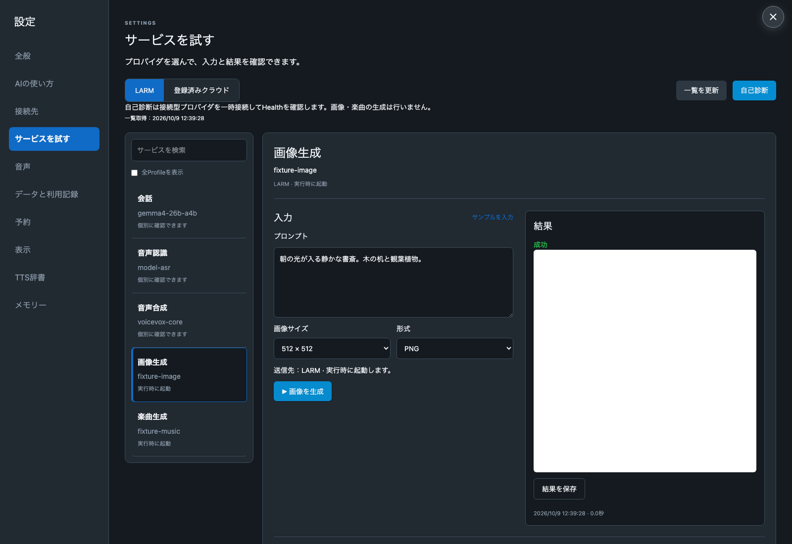
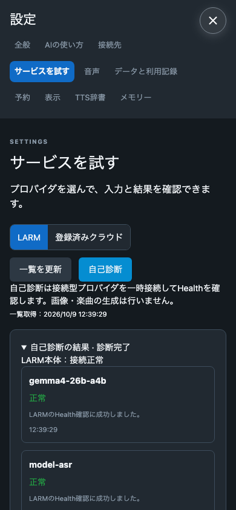

# サービス試用と自己診断の検証

2026-10-09 Asia/Tokyo。設定の「サービスを試す」から、対象を固定した試用と自己診断を行う機能を追加した。

## 実装した操作

- LARM の全 Profile と、保存済み selector・画像用・楽曲用 selector を統合して取得する。一覧取得では起動しない。未対応の protocol や接続方法は表示のみとする。
- 会話、音声認識、音声合成、埋め込み、判断、画像生成、楽曲生成を試用できる。登録済みクラウドの会話・ASR・TTS は対象 resource を固定し、フォールバックさせない。
- サンプル文章を最初から入力する。画像は 512 × 512、楽曲は 10 秒・歌声なしが既定。音声認識は WAV ファイルを指定でき、未指定なら無音で通信と応答形式だけ確認する。
- 自己診断は、このアプリの selector に含まれるプロバイダと登録済みクラウドを対象にする。接続型は一時 Connection を作り、LARM の semantic Health を確認して解放する。正常、混雑、異常、確認不能を分ける。
- 画像・楽曲は専用 Health API がないため「実行時に起動」と「簡単テストで確認」を表示する。生成による診断や停止中の定期 health check は行わない。クラウドも汎用 Health API を仮定せず、個別実行で確認する案内を出す。
- 実行状態は backend の試用台帳へ保存し、既存 SSE によって画面を更新する。二重受付、同時試用、取消後・設定変更後の遅着結果を防止する。
- 生成済みで成果物取得だけ失敗した場合は、生成を再送せず成果物だけ再取得できる。画像の待機終了は遠隔生成の停止を意味しない。楽曲の中止は同じ job の DELETE を確認する。
- 再起動時、実行中だった楽曲の jobId と設定 revision が一致する場合は同じ job を追跡する。同期画像など結果を確定できないものは結果不明とし、再生成しない。
- 入力とプレビューはメモリ上で最大 30 分。プレビューは最大 16 件・合計 256 MB。履歴は概要のみ直近 50 件。通常会話やメモリーへは追加しない。
- LARM credential と成果物の直接 URL は backend に留める。ブラウザへは Eumenes API のみを公開する。成果物は origin・path・MIME・ファイルの識別子を検証する。

現在の LARM はサービスの一覧名と実行モデル名が異なる。画像は `qwen-image-2.1` に対して `Qwen/Qwen-Image-2.1`、楽曲は `ace-step-1.5` に対して `acestep-v15-turbo` が返った。生成先と要求モデルを固定したまま、成果物の実行モデル名を別項目で表示する。Warm の claim では引き続き catalog・作成応答・claim の model と protocol の一致を要求する。

OpenAI 形式の claim に endpoint フィールドはないため、検証済み configuration.fields.baseURL と既知の操作から URL を組み立てる。埋め込み・判断に endpoint がある場合は組み立て結果との一致も検査する。声一覧は control origin の API と control credential を使い、合成には claim の credential を使う。

## Fixture

最終状態で `bun run verify:all` が成功（94,338 ms）。domain 境界、format、lint、型検査、API 250 件、画面 64 件、ビルド、ブラウザ 14 件がすべて通過した。`git diff --check` も成功した。検証中に共有作業環境の別変更が入った実行は合格扱いにせず、ソースが変化しない状態で再実行した。

domain 試験は、起動を伴わない一覧取得、7 用途の adapter、Health と公開情報の区別、認証の分離、claim の不整合、別 origin の成果物拒否、生成 POST 非再送、遅い job 受付後の取消を確認する。

試用 domain は二重受付、異なる入力での同じキーの拒否、同時実行拒否、取消・設定変更後の不採用、入力・出力の本文を DB に保存しないこと、成果物のみの再取得、Health の保存、入力サイズ、既知 job の再起動後追跡を確認する。

画面試験は、選択だけでは実行しないこと、小さい既定値、明示的な自己診断、未適用設定・古い一覧での実行禁止、無音 ASR の説明を確認する。ブラウザでは実際の Eumenes API と fixture LARM を通して画像表示、楽曲プレイヤー、Health 結果、390px 幅での横はみ出しなしを確認する。

## Live

環境で指定された LARM（未指定時はプロジェクト既定）を使った個別 API 確認。製品 DB は使用していない。入力・音声・画像・生応答・認証情報は検証ログへ保存していない。

| 対象 | 確認結果 |
| --- | --- |
| カタログ | このアプリで使う 7 種を取得。全 Profile の services が空でも selector 別に画像・楽曲を取得 |
| Warm の Health | qwen3-asr-1.7b、multilingual-e5-small、gemma4-26b-a4b、laya-multilingual、voicevox-core の 5 種が正常 |
| ASR | 無音 WAV の要求とテキスト応答の形式確認が成功。認識品質の試験ではない |
| 会話 | 短い挨拶への応答取得が成功 |
| 埋め込み | 2 文のベクトル取得、次元と有限値の検査、類似度の算出が成功 |
| 判断 | サンプル挨拶の選択結果の取得が成功 |
| 音声合成 | 既定の声で 128,556 bytes の WAV を取得 |
| 画像 | 512 × 512 PNG を生成。モデル名の扱いを修正後、同じ成果物を GET で取得し、222,871 bytes と PNG 形式を確認。生成 POST は 1 回 |
| 楽曲 | 5 秒の instrumental を生成。queued / loading / completed を追跡。同じ job の metadata と MP3 を取得し、82,988 bytes と形式を確認。生成 POST は 1 回 |

画像 artifact ID は `image_7d35a999f4e94e4d8081f652d783878a`。楽曲 job ID は `music_10e4c1d7-b948-441b-869a-8ab3a49162a4`。実機器のマイク・スピーカーでの音声 3 往復受入は別項目であり、今回の個別成功で音声 MVP 完成とはしない。

## 画面

以下は fixture の画面。画像欄の白い画像は fixture 成果物であり、live の画像ではない。

## 拡張の範囲

OCR と OpenCV はまだ接続先がないため動く項目として追加していない。未知サービスは一覧表示に留め、LARM の契約が決まり次第、入力 schema・adapter・結果 renderer を追加する。対応していない任意 HTTP 呼び出しや script の実行を許可する汎用コンソールにはしていない。
