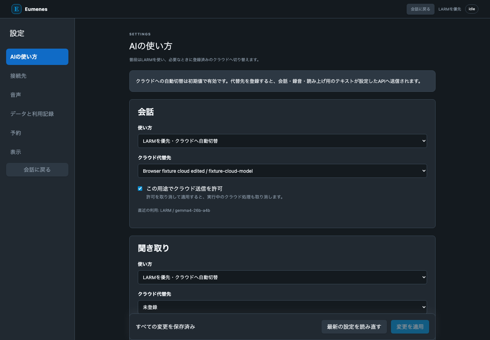
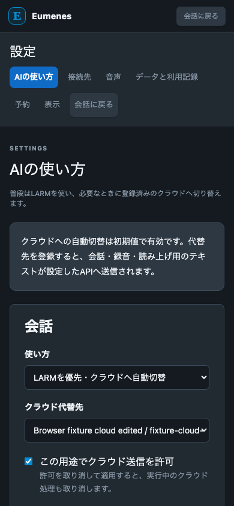

# 設定画面 実装と検証記録

2026年10月8日。設定画面とbackendの実装を完了し、用途別のLARM優先・クラウド自動切替を会話と音声に接続した。設定の保存、暗号化、取消後の不採用、予約管理、テーマ変更を含む全体検証が成功した。

| 検証 | 結果 | 記録 |
| --- | --- | --- |
| fixture と全体検証 | backend 125件、Web 28件、ブラウザ6件成功。format・lint・型・domain境界・build成功 | [fixture](fixtures.md) |
| 実LARM | 新しいsettings/inference経路のASR・LLM・TTS成功。入力は合成日本語音声 | [live](live.md) |
| 実クラウドAPI | 未実施。三用途のHTTP形式と自動切替はfixtureで確認 | [live](live.md) |
| 実マイクとヘッドホン | 3往復と割込みは未受入 | [実機器](devices.md) |

## 実装した動作

六カテゴリの設定画面、用途別ルーティング、LARMのURL・Profile・audience・voice、クラウドの接続とモデル、送信許可、マイク・再生先・録音調整、読み上げと割込み、予約の作成・一時停止・再開・取消、ライト・ダーク・端末設定に合わせるテーマ、利用記録と診断書き出しを追加した。

クラウド登録はOpenAI互換Chat Completions、multipart音声認識、WAV音声合成を対象とする。接続とモデルを分け、一つの認証を複数の用途に使える。初期値はLARM優先・クラウド許可ありで、代替先を登録して適用するまでクラウドへ送信しない。

設定はrevisionとrequest IDで原子的に保存し、受付時にsnapshotを固定する。保存中の追加編集も維持する。キーはbackendでAES-256-GCM暗号化し、秘密を含む要求の照合にはHMACを使う。削除した接続の世代を残し、同じIDの復元で古い許可を復活させない。暗号鍵が見つからない場合は既存暗号文を維持する。

クラウド許可や接続の取消は、実行・採用・音声配信で再検査する。音声認識から回答、回答から音声合成へも失効を伝える。フォールバックは同じrunとJobの内部で最大一回行い、遅れて届いたLARM結果を採用しない。新しい会話実行枠はinference.llmとし、待機中の旧larm.llmを同じ枠へ正規化する。既存migrationは維持し、新規migrationを末尾に追加した。

## APIと記録

settings/contractsに設定と適用入力、inference/contractsに推論portを置き、clientは既存の認証済みtransportを使う。WebはDBやLARM credentialを直接参照しない。設定と試行・採用のSQLはそれぞれのdomainが所有し、複数domainの確定は単一writerのtransactionで行う。

接続確認の具体的な入力はPOST /api/inference/probesのtargetで、larmなら管理APIによる確認、resource IDなら用途別の少量テストを行う。状態・取消はprobe IDで扱う。GET /api/inference/usageは直近100試行を返し、probeを通常の実利用一覧から除外する。診断書き出しは設定診断・取得Provider・実利用記録を組み合わせ、キー・暗号文・会話本文・録音を含めない。旧/api/statusのlarm欄はLARMの状態として維持する。

## 画面

以下はfixtureの接続名とモデルを表示した実装画面。デスクトップと390px幅の画面で確認した。

context_compileとcompile_evalは今回それぞれ1回実行した。設計と計画の依頼を含めた本会話の累計はそれぞれ3回。
